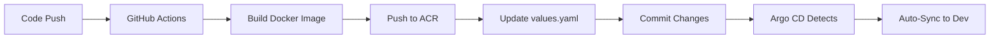

# Production-Grade GitOps Project with Argo CD on Azure

[](https://github.com/YOUR-ORG/YOUR-REPO/actions)

A complete, production-ready GitOps implementation using Argo CD on Azure Kubernetes Service (AKS), demonstrating industry best practices for multi-environment deployments with automated CI/CD pipelines.

## 🏗️ Architecture Overview

```
┌─────────────────────────────────────────────────────────────────────────┐
│                           Developer Workflow                            │
├─────────────────────────────────────────────────────────────────────────┤
│                                                                          │
│  Developer → Git Push → GitHub Actions → Docker Build → Azure ACR      │
│                              ↓                                          │
│                     Update GitOps Manifests                            │
│                              ↓                                          │
│              Argo CD Detects Changes → Sync to Kubernetes              │
│                                                                          │
└─────────────────────────────────────────────────────────────────────────┘

┌──────────────┐     ┌──────────────┐     ┌──────────────┐
│              │     │              │     │              │
│     DEV      │────▶│    STAGE     │────▶│     PROD     │
│              │     │              │     │              │
│ Auto-Sync    │     │ Manual Sync  │     │ Manual Sync  │
│ 1 Replica    │     │ 2 Replicas   │     │ 3 Replicas   │
│              │     │              │     │ + HPA        │
└──────────────┘     └──────────────┘     └──────────────┘
```

## 📁 Repository Structure

```
argo-cd/
├── app/                          # Application source code
│   ├── main.py                   # Flask microservice
│   ├── requirements.txt          # Python dependencies
│   ├── Dockerfile                # Multi-stage production Dockerfile
│   └── .dockerignore             # Docker build exclusions
│
├── helm/                         # Helm chart
│   ├── Chart.yaml                # Chart metadata
│   ├── values.yaml               # Default values
│   ├── .helmignore               # Helm packaging exclusions
│   └── templates/                # Kubernetes manifests
│       ├── deployment.yaml       # Application deployment
│       ├── service.yaml          # ClusterIP service
│       ├── ingress.yaml          # NGINX ingress
│       ├── serviceaccount.yaml   # Service account
│       ├── hpa.yaml              # Horizontal Pod Autoscaler
│       ├── pdb.yaml              # Pod Disruption Budget
│       └── _helpers.tpl          # Template helpers
│
├── environments/                 # Environment-specific configurations
│   ├── dev/
│   │   └── values.yaml           # Dev overrides (1 replica, debug logging)
│   ├── stage/
│   │   └── values.yaml           # Stage overrides (2 replicas, moderate resources)
│   └── prod/
│       └── values.yaml           # Prod overrides (3 replicas, HPA, strict policies)
│
├── argo/                         # Argo CD application definitions
│   ├── application-dev.yaml      # Dev environment (auto-sync)
│   ├── application-stage.yaml    # Stage environment (manual sync)
│   ├── application-prod.yaml     # Prod environment (manual sync + notifications)
│   ├── applicationset.yaml       # Manages all environments
│   └── README.md                 # Argo CD deployment guide
│
├── .github/
│   └── workflows/
│       ├── ci-cd.yaml            # Main CI/CD pipeline
│       └── promote-to-prod.yaml  # Production promotion workflow
│
├── infrastructure/               # Azure infrastructure scripts
│   ├── 01-setup-azure-resources.sh   # AKS + ACR setup
│   ├── 02-install-argocd.sh          # Argo CD installation
│   ├── 99-teardown.sh                # Complete cleanup
│   └── README.md                     # Infrastructure documentation
│
└── README.md                     # This file
```

## 🚀 Quick Start

### Prerequisites

- Azure subscription
- Azure CLI (`az`)
- kubectl
- Helm 3
- Git
- GitHub account

### 1. Clone the Repository

```bash
git clone https://github.com/YOUR-ORG/YOUR-REPO.git
cd argo-cd
```

### 2. Set Up Azure Infrastructure

```bash
cd infrastructure

# Make scripts executable
chmod +x *.sh

# Create AKS cluster and ACR
./01-setup-azure-resources.sh

# Install Argo CD
./02-install-argocd.sh
```

This will create:
- Resource Group: `rg-gitops-demo`
- AKS Cluster: `aks-gitops-demo` (3 nodes)
- Azure Container Registry: `myacr.azurecr.io`
- Namespaces: `argocd`, `gitops-demo-dev`, `gitops-demo-stage`, `gitops-demo-prod`
- NGINX Ingress Controller

### 3. Configure GitHub Secrets

In your GitHub repository, add these secrets (Settings → Secrets and variables → Actions):

#### AZURE_CREDENTIALS
Generate Azure service principal:
```bash
az ad sp create-for-rbac --name 'github-actions-gitops' \
  --role contributor \
  --scopes /subscriptions/<SUBSCRIPTION_ID>/resourceGroups/rg-gitops-demo \
  --sdk-auth
```

Copy the entire JSON output to `AZURE_CREDENTIALS` secret.

#### GITOPS_PAT
Create a GitHub Personal Access Token:
1. Go to GitHub Settings → Developer settings → Personal access tokens → Tokens (classic)
2. Generate new token with `repo` scope
3. Copy token to `GITOPS_PAT` secret

### 4. Update Configuration

Update the following files with your values:

**ACR Name** (if changed from default):
- `helm/values.yaml`
- `environments/*/values.yaml`
- `.github/workflows/ci-cd.yaml`

**GitHub Repository URL**:
- `argo/application-*.yaml`
- `argo/applicationset.yaml`

Replace `YOUR-ORG/YOUR-REPO` with your actual repository path.

### 5. Deploy Argo CD Applications

```bash
# Option 1: Deploy individual environments
kubectl apply -f argo/application-dev.yaml
kubectl apply -f argo/application-stage.yaml
kubectl apply -f argo/application-prod.yaml

# Option 2: Deploy all using ApplicationSet (recommended)
kubectl apply -f argo/applicationset.yaml
```

### 6. Access Argo CD UI

```bash
# Get Argo CD URL and credentials
kubectl get svc argocd-server -n argocd

# Get admin password
kubectl -n argocd get secret argocd-initial-admin-secret -o jsonpath="{.data.password}" | base64 -d
```

Navigate to the IP address shown, login with:
- Username: `admin`
- Password: (from command above)

### 7. Trigger Your First Build

```bash
# Make a change to the application
echo "# Updated" >> app/main.py

# Commit and push
git add app/main.py
git commit -m "feat: trigger first deployment"
git push origin main
```

Watch the GitHub Actions workflow build and push the image, then see Argo CD automatically sync to dev environment!

## 🔄 CI/CD Pipeline Flow

### Automated Flow (Dev Environment)



1. **Developer pushes code** to `main` branch
2. **GitHub Actions triggers**:
   - Builds Docker image with tags: `dev-YYYYMMDD-HHMMSS-SHA`, `dev-latest`
   - Pushes to Azure Container Registry
   - Updates `environments/dev/values.yaml` with new image tag
   - Commits changes back to repository
3. **Argo CD detects change**:
   - Compares Git state with cluster state
   - Automatically syncs to `gitops-demo-dev` namespace
4. **Application deployed** with zero manual intervention

### Manual Flow (Stage → Prod)

#### Promoting to Staging

```bash
# Update stage environment with tested dev image
IMAGE_TAG="dev-20241122-143000-abc1234"

# Update staging values
sed -i "s|tag: .*|tag: \"stage-v1.0.1\"|g" environments/stage/values.yaml

# Commit and push
git add environments/stage/values.yaml
git commit -m "chore: Promote to staging - v1.0.1"
git push origin main

# Manually sync in Argo CD UI or CLI
argocd app sync gitops-demo-app-stage
```

#### Promoting to Production

Use the automated promotion workflow:

```bash
# Via GitHub UI
1. Go to Actions → Promote to Production
2. Click "Run workflow"
3. Enter the stage image tag to promote
4. This creates a PR for production
5. Review and merge the PR
6. Manually sync in Argo CD
```

Or manually:

```bash
# Run the promotion workflow
gh workflow run promote-to-prod.yaml -f source-tag=stage-v1.0.1
```

## 🌍 Environment Details

### Development Environment

**Purpose**: Rapid iteration and testing

**Configuration**:
- Namespace: `gitops-demo-dev`
- Replicas: 1
- Auto-sync: ✅ Enabled
- Resources: Minimal (100m CPU, 128Mi RAM)
- Ingress: `gitops-demo-dev.example.com`
- Logging: DEBUG level

**Use Cases**:
- Feature development
- Bug fixes
- Integration testing

### Staging Environment

**Purpose**: Pre-production validation

**Configuration**:
- Namespace: `gitops-demo-stage`
- Replicas: 2
- Auto-sync: ❌ Manual
- Resources: Moderate (200m CPU, 192Mi RAM)
- Ingress: `gitops-demo-stage.example.com`
- Logging: INFO level
- HPA: Enabled (2-5 replicas)

**Use Cases**:
- User acceptance testing
- Performance testing
- Security scanning
- Final validation before production

### Production Environment

**Purpose**: Live user traffic

**Configuration**:
- Namespace: `gitops-demo-prod`
- Replicas: 3
- Auto-sync: ❌ Manual (strict approval)
- Resources: Production-grade (250m CPU, 256Mi RAM)
- Ingress: `gitops-demo.example.com`
- Logging: WARNING level
- HPA: Enabled (3-10 replicas)
- PDB: Minimum 2 available
- Anti-affinity: Required (spread across nodes)

**Use Cases**:
- Production workloads
- Customer-facing services

## 🛡️ Security Best Practices

### Container Security
- ✅ Multi-stage Docker builds
- ✅ Non-root user (UID 1000)
- ✅ Minimal base image (python:3.11-slim)
- ✅ Read-only root filesystem where possible
- ✅ Dropped all capabilities

### Kubernetes Security
- ✅ Pod Security Context configured
- ✅ Network Policies (can be added)
- ✅ RBAC with Service Accounts
- ✅ Secret management for ACR credentials
- ✅ Resource limits enforced

### GitOps Security
- ✅ Separate namespaces per environment
- ✅ Manual approval for stage/prod
- ✅ Git as single source of truth
- ✅ Audit trail via Git history
- ✅ Argo CD RBAC (can be configured)

## 📊 Monitoring and Observability

### Built-in Features

**Argo CD**:
- Application health status
- Sync status and history
- Resource visualization
- Deployment rollback capability

**Kubernetes**:
- Liveness/Readiness probes on `/health` and `/ready`
- Resource metrics via Metrics Server
- Container logs via `kubectl logs`

### Recommended Additions

```bash
# Prometheus + Grafana for metrics
helm repo add prometheus-community https://prometheus-community.github.io/helm-charts
helm install prometheus prometheus-community/kube-prometheus-stack -n monitoring --create-namespace

# Loki for log aggregation
helm repo add grafana https://grafana.github.io/helm-charts
helm install loki grafana/loki-stack -n monitoring
```

## 🔧 Common Operations

### View Application Status

```bash
# Via kubectl
kubectl get pods -n gitops-demo-dev
kubectl get svc -n gitops-demo-dev
kubectl get ingress -n gitops-demo-dev

# Via Argo CD CLI
argocd app get gitops-demo-app-dev
argocd app history gitops-demo-app-dev
```

### Check Application Logs

```bash
kubectl logs -f -n gitops-demo-dev -l app.kubernetes.io/name=gitops-demo-app
```

### Rollback Deployment

```bash
# Via Argo CD
argocd app rollback gitops-demo-app-dev <REVISION>

# Via Git
git revert <COMMIT_HASH>
git push origin main
```

### Scale Application

```bash
# Temporarily scale (will be reset by GitOps sync)
kubectl scale deployment -n gitops-demo-dev gitops-demo-app --replicas=3

# Permanently scale (update Git)
# Edit environments/dev/values.yaml
replicaCount: 3
# Commit and push
```

### Debug Sync Issues

```bash
# Check Argo CD application status
argocd app get gitops-demo-app-dev

# View sync operation details
argocd app sync gitops-demo-app-dev --dry-run

# Check Argo CD logs
kubectl logs -n argocd -l app.kubernetes.io/name=argocd-application-controller
```

## 🧪 Testing

### Local Testing

```bash
# Test application locally
cd app
python -m venv venv
source venv/bin/activate  # or venv\Scripts\activate on Windows
pip install -r requirements.txt
python main.py

# Test Docker build
docker build -t gitops-demo-app:test .
docker run -p 8080:8080 gitops-demo-app:test

# Test Helm chart
helm template gitops-demo-app ./helm -f environments/dev/values.yaml
helm install gitops-demo-app ./helm -f environments/dev/values.yaml --dry-run --debug
```

### Integration Testing

```bash
# Deploy to dev and test
kubectl port-forward -n gitops-demo-dev svc/gitops-demo-app 8080:80
curl http://localhost:8080/health
curl http://localhost:8080/
```

## 📚 Additional Resources

### Documentation
- [Argo CD Documentation](https://argo-cd.readthedocs.io/)
- [Azure AKS Best Practices](https://docs.microsoft.com/en-us/azure/aks/best-practices)
- [Helm Documentation](https://helm.sh/docs/)
- [GitOps Principles](https://www.gitops.tech/)

### Related Projects
- [Argo Workflows](https://argoproj.github.io/workflows/) - Container-native workflow engine
- [Argo Rollouts](https://argoproj.github.io/rollouts/) - Progressive delivery
- [Sealed Secrets](https://github.com/bitnami-labs/sealed-secrets) - Encrypted secrets
- [External Secrets Operator](https://external-secrets.io/) - Azure Key Vault integration

## 🐛 Troubleshooting

### Argo CD Not Syncing

**Problem**: Application out of sync but not updating

**Solution**:
```bash
# Check application status
argocd app get gitops-demo-app-dev

# Force sync
argocd app sync gitops-demo-app-dev --force

# Check for diff
argocd app diff gitops-demo-app-dev
```

### Image Pull Errors

**Problem**: `ImagePullBackOff` or `ErrImagePull`

**Solution**:
```bash
# Verify ACR credentials secret exists
kubectl get secret acr-secret -n gitops-demo-dev

# Recreate secret if needed
ACR_USERNAME=$(az acr credential show --name myacr --query username -o tsv)
ACR_PASSWORD=$(az acr credential show --name myacr --query passwords[0].value -o tsv)

kubectl create secret docker-registry acr-secret \
  --namespace gitops-demo-dev \
  --docker-server=myacr.azurecr.io \
  --docker-username=$ACR_USERNAME \
  --docker-password=$ACR_PASSWORD
```

### Ingress Not Working

**Problem**: Cannot access application via domain

**Solution**:
```bash
# Check ingress controller
kubectl get pods -n ingress-nginx

# Get external IP
kubectl get svc -n ingress-nginx ingress-nginx-controller

# Check ingress resource
kubectl describe ingress -n gitops-demo-dev

# Verify DNS points to ingress IP
nslookup gitops-demo-dev.example.com
```

### GitHub Actions Failing

**Problem**: CI/CD pipeline fails

**Solution**:
1. Check GitHub Actions logs
2. Verify secrets are configured: `AZURE_CREDENTIALS`, `GITOPS_PAT`
3. Ensure Azure credentials have proper permissions
4. Check ACR registry name matches configuration

## 🧹 Cleanup

To delete all resources:

```bash
cd infrastructure
./99-teardown.sh
```

This will:
- Delete the entire Azure resource group
- Remove all AKS, ACR, and networking resources
- Clean up local kubectl configuration

**⚠️ Warning**: This is irreversible!

## 💰 Cost Optimization

**Estimated Monthly Cost**: $200-250

To reduce costs:

1. **Use smaller VM sizes**:
   ```bash
   # In 01-setup-azure-resources.sh
   NODE_SIZE="Standard_B2s"  # Instead of Standard_D2s_v3
   ```

2. **Reduce node count**:
   ```bash
   NODE_COUNT=2  # Instead of 3
   ```

3. **Use Basic ACR**:
   ```bash
   az acr create --sku Basic  # Instead of Standard
   ```

4. **Stop cluster when not in use**:
   ```bash
   az aks stop --name aks-gitops-demo --resource-group rg-gitops-demo
   az aks start --name aks-gitops-demo --resource-group rg-gitops-demo
   ```

## 🤝 Contributing

1. Fork the repository
2. Create a feature branch
3. Make your changes
4. Test thoroughly
5. Submit a pull request

## 📝 License

This project is licensed under the MIT License - see the LICENSE file for details.

## 🙋 Support

For questions or issues:
- Open an issue in GitHub
- Check the troubleshooting section
- Review Argo CD logs: `kubectl logs -n argocd -l app.kubernetes.io/name=argocd-application-controller`

## ✨ Features

- ✅ **Multi-environment setup** (Dev/Stage/Prod)
- ✅ **Automated CI/CD** with GitHub Actions
- ✅ **GitOps with Argo CD** (declarative deployments)
- ✅ **Azure native** (AKS + ACR)
- ✅ **Production-ready** Helm charts
- ✅ **Security hardened** containers and K8s configs
- ✅ **Horizontal Pod Autoscaling**
- ✅ **Pod Disruption Budgets**
- ✅ **Health checks** and readiness probes
- ✅ **NGINX Ingress** with TLS support
- ✅ **Environment promotion** workflow
- ✅ **Infrastructure as Code** (IaC scripts)

---

**Built with ❤️ for production GitOps deployments**
